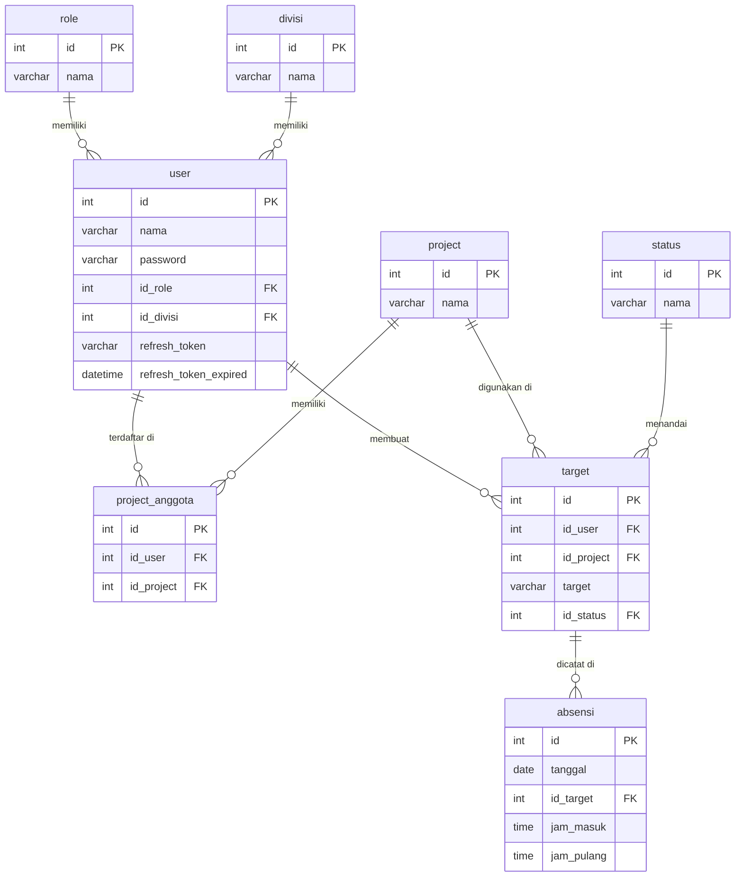

# 📋 Backend Sistem Absensi

Backend REST API untuk sistem absensi berbasis **project & target harian**. Setiap user melakukan absen masuk dengan mencatat project yang dikerjakan beserta target harian, kemudian absen pulang untuk mengupdate status penyelesaian target.

Dibangun dengan **ASP.NET Core 10 Minimal API + MVC**, database **MySQL 8.0**, dan autentikasi **JWT Bearer**.

---

## 🛠️ Tech Stack

| Komponen        | Teknologi                                      |
| --------------- | ---------------------------------------------- |
| Framework       | ASP.NET Core 10 (Minimal API + MVC Hybrid)     |
| Database        | MySQL 8.0                                      |
| ORM             | Dapper 2.1.79                                  |
| Autentikasi     | JWT Bearer + Refresh Token                     |
| Hashing Password| BCrypt.Net-Next 4.2.0                          |
| API Docs        | Scalar + OpenAPI (Swashbuckle)                 |
| Container       | Docker + Docker Compose                        |
| Runtime         | .NET 10                                        |

---

## 📁 Struktur Proyek

```
absensi/
├── Controller/
│   ├── AuthController.cs           # Minimal API — auth endpoints
│   ├── Admin/
│   │   ├── DivisiController.cs     # Minimal API — master data divisi
│   │   ├── RoleController.cs       # Minimal API — master data role
│   │   └── StatusController.cs     # Minimal API — master data status
│   └── User/
│       ├── AnggotaController.cs    # MVC Controller — manajemen anggota
│       ├── PMController.cs         # MVC Controller — manajemen project manager
│       ├── GuruController.cs       # Minimal API — manajemen guru
│       ├── ProjectController.cs    # Minimal API — manajemen project
│       ├── ProjectAnggotaController.cs  # MVC Controller — membership project
│       └── AbsenController.cs      # Minimal API — absen masuk & pulang
├── Models/
│   ├── Auth.cs                     # Login, LoginResponse, UserSessionModel, Policies
│   ├── User.cs                     # User, UserOTD, UserDTO
│   ├── Absen.cs                    # AbsenRekapDTO, AbsenMasukDTO, AbsenPulangDTO
│   ├── Project.cs                  # ProjectOTD, ProjectDTO
│   ├── ProjectAnggota.cs           # ProjectAnggota, ProjectAnggotaOtd, ProjectAnggotaDto
│   ├── Role.cs                     # RoleOTD, RoleDTO
│   ├── Status.cs                   # StatusOTD, StatusDTO
│   └── Divisi.cs                   # DivisiOTD, DivisiDTO
├── Services/
│   ├── Auth/
│   │   └── AuthServices.cs         # Register admin, login, refresh token, get me
│   ├── Features/
│   │   ├── AnggotaService.cs       # CRUD user role Anggota (id_role = 4)
│   │   ├── PMService.cs            # CRUD user role PM (id_role = 2)
│   │   ├── GuruService.cs          # CRUD user role Guru (id_role = 3)
│   │   ├── AbsensiService.cs       # Rekap absensi, absen masuk, absen pulang
│   │   ├── ProjectService.cs       # CRUD project
│   │   └── ProjectAnggotaService.cs # Manajemen anggota project
│   ├── MasterData/
│   │   ├── DivisiService.cs        # CRUD divisi
│   │   ├── StatusService.cs        # Read-only status
│   │   └── RoleService.cs          # Read-only role
│   ├── Infrastructure/
│   │   └── Database.cs             # Koneksi MySQL via MySqlConnection
│   └── Interfaces/
│       ├── IJWTService.cs          # Interface + implementasi JWTService
│       ├── IPasswordService.cs     # Interface + implementasi PasswordService (BCrypt)
│       └── IEnv.cs                 # Static class Env untuk akses konfigurasi global
├── Middlewares/                    # (folder tersedia, siap untuk middleware custom)
├── Properties/
│   └── launchSettings.json         # Profile run lokal (port 5072)
├── Program.cs                      # Entry point, DI container, pipeline middleware
├── appsettings.json                # Konfigurasi connection string & JWT
├── Dockerfile                      # Multi-stage build (SDK 10 → ASPNet 10 runtime)
├── docker-compose.yml              # Orkestrasi backend + MySQL
└── setup.sql                       # DDL schema + seed data awal
```

### Penjelasan Layer Arsitektur

| Layer           | Folder                  | Tanggung Jawab                                              |
| --------------- | ----------------------- | ----------------------------------------------------------- |
| **Controller**  | `Controller/`           | Menerima HTTP request, validasi input dasar, return response |
| **Service**     | `Services/Features/`    | Business logic utama (CRUD, query kompleks)                 |
| **Master Data** | `Services/MasterData/`  | Query read/write data referensi (role, divisi, status)      |
| **Auth**        | `Services/Auth/`        | Autentikasi — register, login, token management             |
| **Infrastructure** | `Services/Infrastructure/` | Koneksi database                                    |
| **Interfaces**  | `Services/Interfaces/`  | Kontrak abstraksi untuk JWT & Password service              |
| **Models**      | `Models/`               | DTO dan OTD (Object Transfer Data) untuk request & response |

> **Catatan Arsitektur:** Proyek ini menggunakan **hybrid pattern** — sebagian endpoint menggunakan **Minimal API** (`MapGroup` di static class), sebagian menggunakan **MVC Controller** (`[ApiController]`). Keduanya terdaftar di `Program.cs`.

---

## 🗄️ Database

### ERD Diagram



### Deskripsi Tabel

#### `role`
| Kolom | Tipe         | Keterangan         |
| ----- | ------------ | ------------------ |
| id    | INT (PK, AI) | Primary key        |
| nama  | VARCHAR(255) | Nama role          |

**Seed data:** `Admin (1)`, `PM (2)`, `Guru (3)`, `Anggota (4)`

---

#### `divisi`
| Kolom | Tipe         | Keterangan         |
| ----- | ------------ | ------------------ |
| id    | INT (PK, AI) | Primary key        |
| nama  | VARCHAR(255) | Nama divisi        |

**Seed data:** `Backend (1)`, `Frontend (2)`, `Game (3)`

---

#### `status`
| Kolom | Tipe         | Keterangan                  |
| ----- | ------------ | --------------------------- |
| id    | INT (PK, AI) | Primary key                 |
| nama  | VARCHAR(255) | Status pengerjaan target    |

**Seed data:** `Null (1)`, `On Progress (2)`, `Done (3)`, `Izin (4)`, `Sakit (5)`

---

#### `project`
| Kolom | Tipe         | Keterangan         |
| ----- | ------------ | ------------------ |
| id    | INT (PK, AI) | Primary key        |
| nama  | VARCHAR(255) | Nama project       |

---

#### `user`
| Kolom                 | Tipe         | Keterangan                              |
| --------------------- | ------------ | --------------------------------------- |
| id                    | INT (PK, AI) | Primary key                             |
| nama                  | VARCHAR(255) | Nama user (digunakan sebagai username)  |
| password              | VARCHAR(255) | Password ter-hash (BCrypt)              |
| id_role               | INT (FK)     | Referensi ke `role.id`, nullable        |
| id_divisi             | INT (FK)     | Referensi ke `divisi.id`, nullable      |
| refresh_token         | VARCHAR(255) | Token untuk refresh JWT                 |
| refresh_token_expired | DATETIME     | Waktu kadaluarsa refresh token          |

---

#### `project_anggota`
| Kolom      | Tipe         | Keterangan                                              |
| ---------- | ------------ | ------------------------------------------------------- |
| id         | INT (PK, AI) | Primary key                                             |
| id_user    | INT (FK)     | Referensi ke `user.id`, CASCADE DELETE                  |
| id_project | INT (FK)     | Referensi ke `project.id`, CASCADE DELETE               |

---

#### `target`
| Kolom      | Tipe         | Keterangan                                              |
| ---------- | ------------ | ------------------------------------------------------- |
| id         | INT (PK, AI) | Primary key                                             |
| id_user    | INT (FK)     | Referensi ke `user.id`, CASCADE DELETE                  |
| id_project | INT (FK)     | Referensi ke `project.id`, CASCADE DELETE               |
| target     | VARCHAR(255) | Deskripsi target yang dikerjakan hari ini               |
| id_status  | INT (FK)     | Referensi ke `status.id`, SET NULL on delete            |

---

#### `absensi`
| Kolom      | Tipe         | Keterangan                                              |
| ---------- | ------------ | ------------------------------------------------------- |
| id         | INT (PK, AI) | Primary key                                             |
| tanggal    | DATE         | Tanggal absensi (diisi `CURRENT_DATE()`)                |
| id_target  | INT (FK)     | Referensi ke `target.id`, CASCADE DELETE                |
| jam_masuk  | TIME         | Waktu absen masuk (diisi `CURRENT_TIME()`)              |
| jam_pulang | TIME         | Waktu absen pulang, diisi saat `PUT /absen/pulang`      |

---

## 🚀 Setup & Menjalankan Project

### Cara 1: Docker Compose (Direkomendasikan)

Pastikan **Docker** dan **Docker Compose** sudah terinstall.

```bash
# Clone / masuk ke direktori proyek
cd absensi

# Build dan jalankan semua service (backend + MySQL)
docker compose up --build
```

Service yang berjalan:

| Service   | Container          | Port Host | Port Container |
| --------- | ------------------ | --------- | -------------- |
| Backend   | `absensi_backend`  | `5072`    | `8080`         |
| MySQL     | `absensi_db`       | `3307`    | `3306`         |

Backend akan **menunggu MySQL siap** (healthcheck) sebelum start.

Schema database (`setup.sql`) dijalankan otomatis saat container MySQL pertama kali dibuat.

```bash
# Jalankan di background
docker compose up --build -d

# Lihat log
docker compose logs -f backend

# Stop semua service
docker compose down

# Stop dan hapus volume (reset database)
docker compose down -v
```

---

### Cara 2: Local (Tanpa Docker)

**Prasyarat:**
- .NET 10 SDK terinstall
- MySQL 8.0 berjalan secara lokal
- Database `absensi` sudah dibuat (jalankan `setup.sql` secara manual)

```bash
# 1. Restore dependencies
dotnet restore

# 2. Update connection string di appsettings.json
#    Sesuaikan Server, Port, Uid, Pwd dengan MySQL lokal kamu

# 3. Jalankan project
dotnet run
```

Akses di: `http://localhost:5072`

---

### Akses API Documentation (Scalar)

Setelah server berjalan, buka browser:

```
http://localhost:5072/scalar
```

Scalar adalah UI interaktif untuk menjelajahi dan mencoba semua endpoint API.

---

## ⚙️ Konfigurasi Environment

> **Penting:** `appsettings.json` sudah masuk `.gitignore` dan **tidak akan ter-commit ke Git**.
> Salin `appsettings.Example.json` ke `appsettings.json`, lalu isi nilainya.

### `appsettings.json` (tidak di-commit)

```json
{
  "ConnectionStrings": {
    "DefaultConnection": "Server=db;Port=3306;Database=absensi;Uid=absensi_user;Pwd=<DB_PASSWORD>;SslMode=Disabled;AllowPublicKeyRetrieval=True;"
  },
  "JWT": {
    "Key": "<JWT_SECRET_KEY_MIN_32_CHARS>",
    "Issuer": "absensi",
    "Audience": "absensiFrontend"
  }
}
```

| Key                                   | Keterangan                                        | Wajib Diisi |
| ------------------------------------- | ------------------------------------------------- | :---------: |
| `ConnectionStrings:DefaultConnection` | Connection string ke MySQL, ganti `<DB_PASSWORD>` | ✅           |
| `JWT:Key`                             | Secret key signing JWT, minimal 32 karakter       | ✅           |
| `JWT:Issuer`                          | Nama issuer JWT                                   | Opsional    |
| `JWT:Audience`                        | Nama audience JWT                                 | Opsional    |

### Override via Docker Compose (lokal)

Untuk dev lokal dengan Docker, buat file `docker-compose.override.yml` (sudah masuk `.gitignore`):

```yaml
# docker-compose.override.yml — JANGAN di-commit
services:
  db:
    environment:
      MYSQL_ROOT_PASSWORD: ganti_dengan_password_root_kamu
      MYSQL_PASSWORD: ganti_dengan_password_db_kamu
  backend:
    environment:
      - ConnectionStrings__DefaultConnection=Server=db;Port=3306;Database=absensi;Uid=absensi_user;Pwd=ganti_dengan_password_db_kamu;SslMode=Disabled;AllowPublicKeyRetrieval=True;
      - JWT__Key=ganti_dengan_jwt_secret_key_min_32_karakter
```

| Variabel                               | Keterangan                                   |
| -------------------------------------- | -------------------------------------------- |
| `MYSQL_ROOT_PASSWORD`                  | Password root MySQL                          |
| `MYSQL_DATABASE`                       | Nama database (`absensi`)                    |
| `MYSQL_USER`                           | Username database (`absensi_user`)           |
| `MYSQL_PASSWORD`                       | Password user database                       |
| `ConnectionStrings__DefaultConnection` | Connection string backend ke MySQL di Docker |
| `JWT__Key`                             | Secret key JWT (override dari appsettings)   |

---

## 📡 API Endpoints

Base URL: `http://localhost:5072`

Token JWT dimasukkan di header:
```
Authorization: Bearer <token>
```

---

### 🔐 Auth — `/api/v1/auth`

#### `POST /api/v1/auth/register-admin`

Mendaftarkan akun Admin pertama. Hanya bisa dilakukan **sekali** — jika Admin sudah ada, request akan ditolak.

**Auth:** Tidak diperlukan

**Request Body:**
```json
{
  "nama": "AdminUtama",
  "password": "password123",
  "id_role": 1,
  "id_divisi": null
}
```

**Response 200:**
```json
{
  "message": "Admin berhasil didaftarkan"
}
```

**Response 400 (Admin sudah ada):**
```json
{
  "message": "Registrasi admin ditutup karena admin sudah ada"
}
```

---

#### `POST /api/v1/auth/login`

Login untuk semua role. Mengembalikan JWT Access Token dan Refresh Token.

**Auth:** Tidak diperlukan

**Request Body:**
```json
{
  "nama": "AdminUtama",
  "password": "password123"
}
```

**Response 200:**
```json
{
  "token": "eyJhbGciOiJIUzI1NiIsInR5cCI6IkpXVCJ9...",
  "refresh_Token": "base64encodedrefreshtoken...",
  "nama": "AdminUtama",
  "role": "Admin"
}
```

**Response 401:** User tidak ditemukan atau password salah.

---

#### `POST /api/v1/auth/refresh`

Memperbarui Access Token menggunakan Refresh Token yang masih valid. Refresh Token berlaku selama **20 hari**.

**Auth:** Tidak diperlukan

**Request Body:**
```json
{
  "refreshToken": "base64encodedrefreshtoken..."
}
```

**Response 200:**
```json
{
  "token": "eyJhbGciOiJIUzI1NiIsInR5cCI6IkpXVCJ9...",
  "refresh_Token": "newbase64encodedrefreshtoken...",
  "nama": "AdminUtama",
  "role": "Admin"
}
```

**Response 401:** Refresh token tidak valid atau sudah kadaluarsa.

---

#### `GET /api/v1/auth/me`

Mengambil profil user yang sedang login berdasarkan JWT claim.

**Auth:** ✅ JWT Bearer diperlukan

**Response 200:**
```json
{
  "id": 1,
  "nama": "AdminUtama",
  "role": "Admin",
  "divisi": "Backend"
}
```

**Response 401:** Token tidak valid atau tidak disertakan.

---

### 📦 Master Data

#### Role — `/api/v1/role`

| Method | Endpoint       | Auth | Deskripsi           |
| ------ | -------------- | ---- | ------------------- |
| GET    | `/api/v1/role` | ❌    | Ambil semua role    |

**Response 200 `GET /api/v1/role`:**
```json
[
  { "id": 1, "nama": "Admin" },
  { "id": 2, "nama": "PM" },
  { "id": 3, "nama": "Guru" },
  { "id": 4, "nama": "Anggota" }
]
```

---

#### Status — `/api/v1/status`

| Method | Endpoint         | Auth | Deskripsi           |
| ------ | ---------------- | ---- | ------------------- |
| GET    | `/api/v1/status` | ❌    | Ambil semua status  |

**Response 200 `GET /api/v1/status`:**
```json
[
  { "id": 1, "nama": "Null" },
  { "id": 2, "nama": "On Progress" },
  { "id": 3, "nama": "Done" },
  { "id": 4, "nama": "Izin" },
  { "id": 5, "nama": "Sakit" }
]
```

---

#### Divisi — `/api/v1/divisi`

| Method | Endpoint              | Auth | Deskripsi              |
| ------ | --------------------- | ---- | ---------------------- |
| GET    | `/api/v1/divisi`      | ❌    | Ambil semua divisi     |
| GET    | `/api/v1/divisi/{id}` | ❌    | Ambil divisi by ID     |
| POST   | `/api/v1/divisi`      | ❌    | Tambah divisi baru     |
| PUT    | `/api/v1/divisi/{id}` | ❌    | Update divisi by ID    |
| DELETE | `/api/v1/divisi/{id}` | ❌    | Hapus divisi by ID     |

**Request Body `POST/PUT /api/v1/divisi`:**
```json
{
  "id": 0,
  "nama": "Mobile"
}
```

**Response 200 `GET /api/v1/divisi`:**
```json
[
  { "id": 1, "nama": "Backend" },
  { "id": 2, "nama": "Frontend" },
  { "id": 3, "nama": "Game" }
]
```

**Response 201 `POST /api/v1/divisi`:**
```json
{
  "id": 0,
  "nama": "Mobile"
}
```

---

#### Project — `/api/v1/project`

| Method | Endpoint               | Auth | Deskripsi              |
| ------ | ---------------------- | ---- | ---------------------- |
| GET    | `/api/v1/project`      | ❌    | Ambil semua project    |
| GET    | `/api/v1/project/{id}` | ❌    | Ambil project by ID    |
| POST   | `/api/v1/project`      | ❌    | Tambah project baru    |
| PUT    | `/api/v1/project/{id}` | ❌    | Update project by ID   |
| DELETE | `/api/v1/project/{id}` | ❌    | Hapus project by ID    |

**Request Body `POST/PUT /api/v1/project`:**
```json
{
  "id": 0,
  "nama": "Project Alpha"
}
```

**Response 200 `GET /api/v1/project`:**
```json
[
  { "id": 1, "nama": "Project Alpha" },
  { "id": 2, "nama": "Project Beta" }
]
```

---

### 👥 User Management

#### Guru — `/api/v1/guru`

| Method | Endpoint              | Auth         | Deskripsi                       |
| ------ | --------------------- | ------------ | ------------------------------- |
| GET    | `/api/v1/guru`        | ✅ JWT        | Ambil semua guru                |
| GET    | `/api/v1/guru/{id}`   | ✅ JWT        | Ambil guru by ID                |
| POST   | `/api/v1/guru`        | ✅ Admin only | Tambah guru baru                |
| PUT    | `/api/v1/guru/{id}`   | ✅ Admin only | Update data guru                |
| DELETE | `/api/v1/guru/{id}`   | ✅ Admin only | Hapus guru                      |

**Request Body `POST /api/v1/guru`:**
```json
{
  "nama": "Bu Sari",
  "password": "password123",
  "id_role": 3,
  "id_divisi": 1
}
```

**Response 200 `GET /api/v1/guru`:**
```json
[
  {
    "id": 3,
    "nama": "Bu Sari",
    "role": "Guru",
    "divisi": "Backend"
  }
]
```

**Response 200 `POST /api/v1/guru`:**
```json
{
  "message": "Data guru berhasil ditambahkan"
}
```

---

#### Project Manager — `/api/PM`

| Method | Endpoint           | Auth | Deskripsi                         |
| ------ | ------------------ | ---- | --------------------------------- |
| GET    | `/api/PM`          | ❌    | Ambil semua Project Manager       |
| POST   | `/api/PM/register` | ❌    | Daftarkan Project Manager baru    |

**Request Body `POST /api/PM/register`:**
```json
{
  "nama": "Budi PM",
  "password": "password123",
  "id_role": 2,
  "id_divisi": 2
}
```

**Response 200 `GET /api/PM`:**
```json
[
  {
    "id": 2,
    "nama": "Budi PM",
    "role": "PM",
    "divisi": "Frontend"
  }
]
```

**Response 200 `POST /api/PM/register`:**
```json
{
  "message": "Project Manager berhasil ditambahkan"
}
```

---

#### Anggota — `/api/Anggota`

| Method | Endpoint                | Auth | Deskripsi                   |
| ------ | ----------------------- | ---- | --------------------------- |
| GET    | `/api/Anggota`          | ❌    | Ambil semua anggota         |
| POST   | `/api/Anggota/register` | ❌    | Daftarkan anggota baru      |

**Request Body `POST /api/Anggota/register`:**
```json
{
  "nama": "Andi Anggota",
  "password": "password123",
  "id_role": 4,
  "id_divisi": 1
}
```

**Response 200 `GET /api/Anggota`:**
```json
[
  {
    "id": 5,
    "nama": "Andi Anggota",
    "role": "Anggota",
    "divisi": "Backend"
  }
]
```

**Response 200 `POST /api/Anggota/register`:**
```json
{
  "message": "Anggota berhasil ditambahkan"
}
```

---

### 🔗 Project Anggota — `/api/v1/project-anggota`

Mengelola keanggotaan user dalam project tertentu.

| Method | Endpoint                       | Auth   | Deskripsi                        |
| ------ | ------------------------------ | ------ | -------------------------------- |
| GET    | `/api/v1/project-anggota`      | ✅ JWT  | Ambil semua anggota dari project |
| POST   | `/api/v1/project-anggota`      | ✅ JWT  | Tambahkan user ke project        |
| DELETE | `/api/v1/project-anggota/{id}` | ✅ JWT  | Hapus user dari project          |

**Request Body `POST /api/v1/project-anggota`:**
```json
{
  "user": 5,
  "project": 1
}
```

**Response 200 `GET /api/v1/project-anggota`:**
```json
[
  {
    "id": 1,
    "idUser": 5,
    "idProject": 1,
    "username": "Andi Anggota",
    "project": "Project Alpha"
  }
]
```

**Response 200 `POST /api/v1/project-anggota`:**
```json
{
  "message": "Berhasil menambahkan anggota ke project"
}
```

**Response 200 `DELETE /api/v1/project-anggota/1`:**
```json
{
  "message": "Berhasil menghapus anggota dari project"
}
```

---

### 🕐 Absensi — `/api/v1/absen`

Semua endpoint absensi memerlukan JWT.

#### `GET /api/v1/absen?tanggal=YYYY-MM-DD`

Mengambil rekap absensi semua user (kecuali Admin) berdasarkan tanggal.

**Auth:** ✅ JWT Bearer diperlukan

**Query Parameter:**

| Parameter | Tipe   | Contoh       | Keterangan              |
| --------- | ------ | ------------ | ----------------------- |
| `tanggal` | string | `2026-09-08` | Format `YYYY-MM-DD`     |

**Response 200:**
```json
[
  {
    "idAbsensi": 1,
    "tanggal": "2026-09-08",
    "nama": "Andi Anggota",
    "divisi": "Backend",
    "project": "Project Alpha",
    "target": "Membuat API endpoint auth",
    "status": "Done",
    "jamMasuk": "08:30",
    "jamPulang": "17:00"
  },
  {
    "idAbsensi": 2,
    "tanggal": "2026-09-08",
    "nama": "Budi PM",
    "divisi": "Frontend",
    "project": "-",
    "target": "-",
    "status": "Null",
    "jamMasuk": "09:00",
    "jamPulang": null
  }
]
```

---

#### `POST /api/v1/absen/masuk`

Absen masuk. Otomatis mengambil **ID user dari JWT claim** — tidak perlu kirim `id_user`. 

Proses di dalam:
1. Insert ke tabel `target` (project + deskripsi target + status awal)
2. Ambil `LAST_INSERT_ID()` dari koneksi yang sama
3. Insert ke tabel `absensi` dengan `tanggal = CURRENT_DATE()` dan `jam_masuk = CURRENT_TIME()`

**Auth:** ✅ JWT Bearer diperlukan

**Request Body:**
```json
{
  "idProject": 1,
  "target": "Membuat API endpoint auth",
  "idStatus": 2
}
```

| Field      | Tipe   | Keterangan                                   |
| ---------- | ------ | -------------------------------------------- |
| `idProject`| int    | ID project yang dikerjakan                   |
| `target`   | string | Deskripsi target/pekerjaan hari ini          |
| `idStatus` | int    | Status awal (biasanya `2` = On Progress)     |

**Response 200:**
```json
{
  "message": "absen masuk berhasil"
}
```

**Response 400:**
```json
{
  "message": "gagal melakukan absen masuk, periksa kembali id project"
}
```

---

#### `PUT /api/v1/absen/pulang`

Absen pulang. Mengupdate status target dan mengisi `jam_pulang` di tabel `absensi`.

**Auth:** ✅ JWT Bearer diperlukan

**Request Body:**
```json
{
  "idAbsensi": 1,
  "idTarget": 1,
  "idStatus": 3
}
```

| Field       | Tipe | Keterangan                                    |
| ----------- | ---- | --------------------------------------------- |
| `idAbsensi` | int  | ID absensi yang ingin diupdate jam pulangnya  |
| `idTarget`  | int  | ID target yang status-nya ingin diupdate      |
| `idStatus`  | int  | Status akhir (contoh: `3` = Done, `4` = Izin) |

**Response 200:**
```json
{
  "message": "Absen pulang berhasil"
}
```

**Response 400:**
```json
{
  "message": "gagal melakukan absen pulang, data absensi tidak ditemukan"
}
```

---

## 📐 Models Reference

### Models Utama

| Class               | File                    | Kegunaan                                                |
| ------------------- | ----------------------- | ------------------------------------------------------- |
| `AdminOTD`          | `Models/Auth.cs`        | Input register admin                                    |
| `Login`             | `Models/Auth.cs`        | Input login (nama + password)                           |
| `LoginResponse`     | `Models/Auth.cs`        | Output login (token, refresh token, nama, role)         |
| `UserSessionModel`  | `Models/Auth.cs`        | Internal — data user dari DB saat proses login          |
| `RefreshRequest`    | `Models/Auth.cs`        | Input refresh token                                     |
| `Policies`          | `Models/Auth.cs`        | Definisi policy authorization per role                  |
| `User`              | `Models/User.cs`        | Entity user lengkap (termasuk navigation property)      |
| `UserOTD`           | `Models/User.cs`        | Input create/update user                                |
| `UserDTO`           | `Models/User.cs`        | Output data user (tanpa password)                       |
| `AbsenRekapDTO`     | `Models/Absen.cs`       | Output rekap absensi per tanggal                        |
| `AbsenMasukDTO`     | `Models/Absen.cs`       | Input absen masuk                                       |
| `AbsenPulangDTO`    | `Models/Absen.cs`       | Input absen pulang                                      |
| `ProjectOTD`        | `Models/Project.cs`     | Input create project                                    |
| `ProjectDTO`        | `Models/Project.cs`     | Input/output project (dengan ID)                        |
| `ProjectAnggota`    | `Models/ProjectAnggota.cs` | Output membership project (join user + project)      |
| `ProjectAnggotaOtd` | `Models/ProjectAnggota.cs` | Input tambah anggota (dengan field nama lengkap)     |
| `ProjectAnggotaDto` | `Models/ProjectAnggota.cs` | Input tambah anggota (field `User` + `Project`)      |
| `RoleOTD`           | `Models/Role.cs`        | Input create role                                       |
| `RoleDTO`           | `Models/Role.cs`        | Output role                                             |
| `StatusOTD`         | `Models/Status.cs`      | Input create status                                     |
| `StatusDTO`         | `Models/Status.cs`      | Output status                                           |
| `DivisiOTD`         | `Models/Divisi.cs`      | Input create divisi                                     |
| `DivisiDTO`         | `Models/Divisi.cs`      | Output divisi                                           |

---

## 📦 NuGet Packages

| Package                                    | Versi      | Kegunaan                              |
| ------------------------------------------ | ---------- | ------------------------------------- |
| `BCrypt.Net-Next`                          | `4.2.0`    | Hashing & verifikasi password         |
| `Dapper`                                   | `2.1.79`   | Micro-ORM untuk query SQL ke MySQL    |
| `Microsoft.AspNetCore.Authentication.JwtBearer` | `10.0.10` | JWT Bearer authentication          |
| `Microsoft.AspNetCore.OpenApi`             | `10.0.11`  | Generate OpenAPI spec                 |
| `Microsoft.OpenApi`                        | `2.7.5`    | Library OpenAPI                       |
| `MySql.Data`                               | `26.7.0`   | MySQL connector (koneksi database)    |
| `MySqlConnector`                           | `2.6.1`    | MySQL connector alternatif            |
| `Scalar.AspNetCore`                        | `2.17.2`   | UI interaktif untuk API docs          |
| `Swashbuckle.AspNetCore`                   | `10.2.3`   | Swagger/OpenAPI tooling               |

---

## 📝 Catatan Penting

### Alur Absensi
```
User Login → Dapat JWT Token
     ↓
POST /absen/masuk → Pilih project + isi target + set status
     ↓ (insert ke tabel target → ambil ID → insert ke tabel absensi)
Kerja seharian...
     ↓
PUT /absen/pulang → Update status target + isi jam_pulang
     ↓
GET /absen?tanggal=... → Lihat rekap harian semua user
```

### Authorization Policy

| Role              | id_role | Akses                                                   |
| ----------------- | ------- | ------------------------------------------------------- |
| **Admin**         | 1       | Semua endpoint + CRUD Guru + Register Admin (1x)        |
| **Project Manager** | 2     | Endpoint yang butuh JWT                                 |
| **Guru**          | 3       | Endpoint yang butuh JWT                                 |
| **Anggota**       | 4       | Endpoint yang butuh JWT + absen masuk/pulang            |

### JWT Token
- **Access Token** berlaku **7 hari**
- **Refresh Token** berlaku **20 hari**
- Klaim JWT berisi: `sub` (user ID), `name` (nama user), `role` (nama role)
- ID user dari JWT diambil via `ClaimTypes.NameIdentifier` di endpoint absen masuk

### Penting: `LAST_INSERT_ID()` di AbsensiService
Proses `AbsenMasuk` menggunakan koneksi yang sama (tidak ditutup antar query) agar `SELECT LAST_INSERT_ID()` mengembalikan ID yang benar dari insert `target` sebelumnya.

---

*Dokumentasi dibuat berdasarkan source code proyek — last updated: September 2026*
