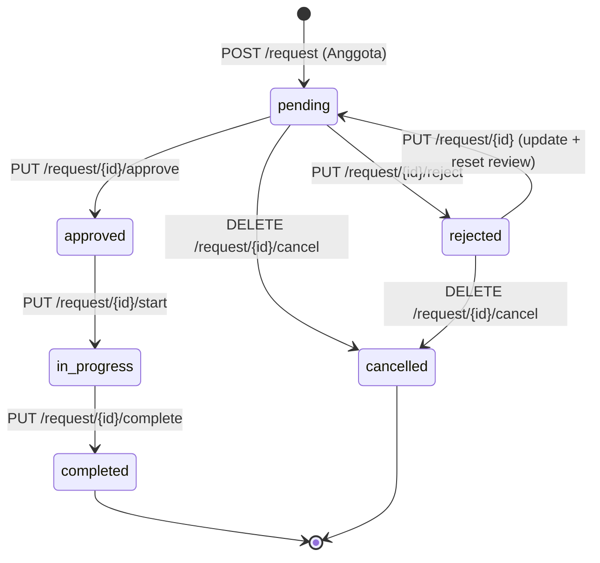

# API Hosting Request (Backend Absensi)

Dokumen ini menjelaskan endpoint hosting request pada backend Absensi: pengajuan hosting oleh Anggota, review PM, pengerjaan DevOps, serta aturan status yang dikunci di WHERE clause setiap service method. Semua rute berada di bawah group `/api/v1/hosting` dan memerlukan JWT Bearer (lihat [authentication.md](authentication.md)); skema tabel `hosting_request` mengikuti [database.md](database.md) dan `setup.sql`.

---

## Base URL & Autentikasi

| Item | Nilai |
| ---- | ----- |
| Base URL | `http://localhost:5072` |
| Prefix group | `/api/v1/hosting` |
| Auth | `Authorization: Bearer <token>` |

Seluruh rute wajib JWT (`RequireAuthorization()` pada group). Beberapa rute menambahkan policy role (`RequireRole(...)`); detailnya di tabel endpoint.

---

## Status Hosting Request

### Konstanta `HostingStatus` ↔ ENUM database

Konstanta di `Models/Constants.cs` (`HostingStatus`) dipakai service dan controller; nilai yang sama didefinisikan di ENUM kolom `status` tabel `hosting_request` pada `setup.sql`.

| Konstanta (`HostingStatus`) | Nilai string | ENUM database `status` | Keterangan |
| --------------------------- | ------------ | ---------------------- | ---------- |
| `Pending` | `pending` | `pending` (default) | Baru dibuat / menunggu review PM / hasil update dari `rejected` |
| `Approved` | `approved` | `approved` | Disetujui PM, antrean DevOps |
| `Rejected` | `rejected` | `rejected` | Ditolak PM; bisa di-update (reset ke `pending`) atau di-cancel |
| `InProgress` | `in_progress` | `in_progress` | Sedang ditangani DevOps |
| `Completed` | `completed` | `completed` | Hosting selesai |
| `Cancelled` | `cancelled` | `cancelled` | Dibatalkan pemohon/Admin (soft delete) |

### Diagram state machine



Jalur utama: `pending → approved → in_progress → completed`. Percabangan: `rejected` kembali ke `pending` saat di-update; `cancelled` dari `pending` atau `rejected`. `completed` dan `cancelled` tidak punya transisi keluar pada service method mana pun.

### Penjelasan transisi (dikunci di WHERE clause service)

Setiap mutasi status dikunci lewat WHERE clause pada `HostingRequestService` (sering bersama transaksi `FOR UPDATE` / `BeginTransaction`), sehingga dua permintaan bersamaan tidak bisa melompati status yang salah:

| Transisi | Service method | Kunci WHERE clause (ringkas) |
| -------- | -------------- | ---------------------------- |
| (baru) → `pending` | `Create` | INSERT dengan `status = pending` |
| `pending` → `approved` | `Approve` | `WHERE id = @Id AND status = 'pending'` — set `id_pm_reviewer`, `pm_notes`, `pm_reviewed_at` |
| `pending` → `rejected` | `Reject` | `WHERE id = @Id AND status = 'pending'` — set field review PM yang sama |
| `pending` → `pending` (edit konten) | `Update` | Baca `SELECT status ... FOR UPDATE`; cabang pending: `WHERE id = @Id AND status = 'pending'` |
| `rejected` → `pending` (edit + reset) | `Update` | Cabang rejected: `WHERE id = @Id AND status = 'rejected'` — set ulang field konten, `status = 'pending'`, `id_pm_reviewer`/`pm_notes`/`pm_reviewed_at` di-NULL-kan (bersihkan jejak review) |
| `approved` → `in_progress` | `StartProcessing` | `WHERE id = @Id AND status = 'approved' AND (@IsAdmin = 1 OR EXISTS (user dengan id_role = DevOps))` — set `id_devops_handler` |
| `in_progress` → `completed` | `Complete` | `WHERE id = @Id AND status = 'in_progress' AND (@IsAdmin = 1 OR id_devops_handler = @DevOpsId)` — set `devops_notes`, `hosting_url` |
| `pending`/`rejected` → `cancelled` | `Cancel` | `WHERE id = @Id AND status IN ('pending','rejected')` |
| (status apa pun) → hapus baris | `Delete` | `DELETE FROM hosting_request WHERE id = @Id` (tanpa syarat status; Admin only) |

Catatan: `UpdateDevOpsNotes` tidak mengubah status — hanya `devops_notes`, dengan kunci `status IN ('in_progress','completed')` dan `(@IsAdmin = 1 OR id_devops_handler = @DevOpsId)`.

---

## Tabel Endpoint Lengkap (14 route)

| # | Method | Endpoint | Policy role (RequireAuthorization) | Syarat status (WHERE / handler) | Siapa boleh (handler vs Admin) |
| - | ------ | -------- | ---------------------------------- | ------------------------------- | ------------------------------ |
| 1 | GET | `/api/v1/hosting/requests` | JWT saja di group; handler membatasi | Opsional query `?status=`; staff lihat semua, Anggota hanya miliknya | Staff (Admin/PM/DevOps) vs Anggota; role lain → 403 |
| 2 | GET | `/api/v1/hosting/my-requests` | Admin, PM, DevOps, Anggota | Tanpa filter status | Selalu data milik `caller.UserId` |
| 3 | GET | `/api/v1/hosting/pending` | Admin, PM | Filter `status = pending` (service `GetAll`) | Admin / PM |
| 4 | GET | `/api/v1/hosting/approved` | Admin, DevOps | Filter `status = approved` | Admin / DevOps |
| 5 | GET | `/api/v1/hosting/request/{id}` | JWT saja di group; `CanAccessRequest` | Tanpa syarat status | Staff lihat semua; Anggota hanya miliknya; lainnya → 403 |
| 6 | POST | `/api/v1/hosting/request` | Anggota | Insert dengan `status = pending` | Hanya Anggota |
| 7 | PUT | `/api/v1/hosting/request/{id}` | Admin, Anggota | `pending` ATAU `rejected` (dicek handler + service); dari `rejected` → reset `pending` | Pemilik (`IdUser`) atau Admin; selain itu → 403 |
| 8 | PUT | `/api/v1/hosting/request/{id}/approve` | Admin, PM | `WHERE status = 'pending'` | Admin / PM (tanpa cek handler per-baris) |
| 9 | PUT | `/api/v1/hosting/request/{id}/reject` | Admin, PM | `WHERE status = 'pending'` | Admin / PM (tanpa cek handler per-baris) |
| 10 | PUT | `/api/v1/hosting/request/{id}/start` | Admin, DevOps | `WHERE status = 'approved' AND (admin OR caller id_role DevOps di DB)` | Admin bypass; selain Admin harus role DevOps di database (`RoleIds.DevOps = 5`) |
| 11 | PUT | `/api/v1/hosting/request/{id}/complete` | Admin, DevOps | `WHERE status = 'in_progress' AND (admin OR id_devops_handler = caller)` | Admin atau handler yang tercatat di `id_devops_handler` |
| 12 | PUT | `/api/v1/hosting/request/{id}/notes` | Admin, DevOps | `WHERE status IN ('in_progress','completed') AND (admin OR id_devops_handler = caller)` | Admin atau handler |
| 13 | DELETE | `/api/v1/hosting/request/{id}/cancel` | Admin, Anggota | `WHERE status IN ('pending','rejected')` | Pemilik (`IdUser`) atau Admin; selain itu → 403 |
| 14 | DELETE | `/api/v1/hosting/request/{id}` | Admin | Tanpa syarat status (hard delete) | Hanya Admin |

---

## Detail Endpoint

### 1. `GET /api/v1/hosting/requests`

Mengambil daftar hosting request dengan filter status opsional. Staff melihat semua baris; Anggota hanya miliknya; role selain staff/Anggota (mis. Guru) mendapat 403 dari handler.

**Auth:** JWT (group); handler: `IsStaff()` (Admin/PM/DevOps) → `GetAll(status)`; `Role == "Anggota"` → `GetAll(status, caller.UserId)`; selain itu `Forbid`.

**Query parameter:**

| Parameter | Tipe   | Wajib | Keterangan                          |
| --------- | ------ | ----- | ----------------------------------- |
| `status`  | string | Tidak | Salah satu nilai ENUM (mis. `pending`) |

**Response 200:** array `HostingRequestListDTO`, diurutkan `created_at DESC`.

```json
[
  {
    "id": 1,
    "userName": "Andi Anggota",
    "projectName": "Project Alpha",
    "contactName": "Andi",
    "status": "pending",
    "pmReviewerName": null,
    "devOpsHandlerName": null,
    "createdAt": "2026-09-08T07:00:00"
  }
]
```

**Response 401:** klaim user tidak bisa dibaca. **Response 403:** role bukan staff/Anggota.

---

### 2. `GET /api/v1/hosting/my-requests`

Shortcut daftar request milik caller (tanpa filter status).

**Auth:** policy `Admin`, `PM`, `DevOps`, `Anggota`. Selalu memanggil `GetAll(null, caller.UserId)`.

**Response 200:** array `HostingRequestListDTO` milik caller saja.

---

### 3. `GET /api/v1/hosting/pending`

Antrean review PM.

**Auth:** policy `Admin`, `PM`. Service: `GetAll(HostingStatus.Pending)` (hanya baris `status = pending`).

**Response 200:** array `HostingRequestListDTO`.

---

### 4. `GET /api/v1/hosting/approved`

Antrean pengerjaan DevOps.

**Auth:** policy `Admin`, `DevOps`. Service: `GetAll(HostingStatus.Approved)`.

**Response 200:** array `HostingRequestListDTO`.

---

### 5. `GET /api/v1/hosting/request/{id}`

Detail satu request (response lengkap dengan JOIN).

**Auth:** JWT; setelah `GetById`, `caller.CanAccessRequest(request)` — Admin/PM/DevOps selalu boleh; Anggota hanya jika `request.IdUser == caller.UserId`; selain itu 403.

**Response 200:** objek `HostingRequestDTO`:

```json
{
  "id": 1,
  "idUser": 5,
  "userName": "Andi Anggota",
  "idProject": 1,
  "projectName": "Project Alpha",
  "contactName": "Andi",
  "contactEmail": "andi@example.com",
  "contactPhone": "08123456789",
  "projectDescription": "Landing page produk",
  "techStack": "Next.js, MySQL",
  "repositoryUrl": "https://github.com/example/repo",
  "documentationUrl": "https://docs.example.com",
  "status": "pending",
  "idPmReviewer": null,
  "pmReviewerName": null,
  "pmNotes": null,
  "pmReviewedAt": null,
  "idDevOpsHandler": null,
  "devOpsHandlerName": null,
  "devOpsNotes": null,
  "hostingUrl": null,
  "createdAt": "2026-09-08T07:00:00",
  "updatedAt": "2026-09-08T07:00:00"
}
```

**Response 404:** `{"message": "Hosting request tidak ditemukan"}`. **403:** `CanAccessRequest` false. **401:** klaim user tidak ada.

---

### 6. `POST /api/v1/hosting/request`

Membuat hosting request baru (status selalu `pending`). `idUser` diambil dari JWT, bukan dari body.

**Auth:** policy `Anggota`.

**Request body (`HostingRequestCreateDTO`):**

| Field | Tipe | Wajib | Keterangan |
| ----- | ---- | ----- | ---------- |
| `idProject` | int | Ya | FK `project.id` |
| `contactName` | string | Ya | Nama kontak |
| `contactEmail` | string | Ya | Email kontak |
| `contactPhone` | string | Ya | Telepon kontak |
| `projectDescription` | string/null | Tidak | Deskripsi project |
| `techStack` | string/null | Tidak | Tech stack |
| `repositoryUrl` | string/null | Tidak | URL repo |
| `documentationUrl` | string/null | Tidak | URL dokumentasi |

```json
{
  "idProject": 1,
  "contactName": "Andi",
  "contactEmail": "andi@example.com",
  "contactPhone": "08123456789",
  "projectDescription": "Landing page produk",
  "techStack": "Next.js",
  "repositoryUrl": "https://github.com/example/repo",
  "documentationUrl": null
}
```

**Response 201:**

```json
{
  "id": 1,
  "message": "Hosting request berhasil dibuat"
}
```

Location: `/api/v1/hosting/request/{id}`. **403:** bukan Anggota.

---

### 7. `PUT /api/v1/hosting/request/{id}`

Update konten request hanya bila status masih `pending` atau `rejected`.

**Auth:** policy `Admin`, `Anggota`. Handler: selain Admin, `existing.IdUser` harus sama dengan caller (selain itu 403); status selain `pending`/`rejected` → 400 `"Request tidak bisa diupdate karena sudah diproses"`.

**Service `Update`:** baca status dengan `SELECT ... FOR UPDATE`. Jika `rejected`: update field konten **dan** `status = pending`, `id_pm_reviewer`/`pm_notes`/`pm_reviewed_at` di-NULL-kan (bersihkan jejak review PM agar bisa ditinjau ulang). Jika `pending`: update field konten saja, status tetap `pending`.

**Request body (`HostingRequestUpdateDTO`):** field sama dengan `HostingRequestCreateDTO`.

**Response 200:** `{"message": "Hosting request berhasil diperbarui"}`. **400:** status tidak diizinkan atau update 0 baris. **404:** tidak ditemukan. **403:** bukan pemilik dan bukan Admin.

---

### 8. `PUT /api/v1/hosting/request/{id}/approve`

PM (atau Admin) menyetujui request.

**Auth:** policy `Admin`, `PM`. Service `Approve`: `WHERE id AND status = 'pending'` → `status = approved` + isi `id_pm_reviewer`, `pm_notes`, `pm_reviewed_at` (UTC).

**Request body (`HostingRequestReviewDTO`):**

| Field | Tipe | Keterangan |
| ----- | ---- | ---------- |
| `notes` | string | Catatan review PM |

```json
{ "notes": "Disetujui, lanjut DevOps" }
```

**Response 200:** `{"message": "Hosting request berhasil di-approve"}`. **400:** `{"message": "Gagal approve request. Pastikan status masih pending."}`.

---

### 9. `PUT /api/v1/hosting/request/{id}/reject`

PM (atau Admin) menolak request.

**Auth:** policy `Admin`, `PM`. Service `Reject`: kunci sama dengan Approve (`status = 'pending'`), hasil `status = rejected` + field review PM.

**Request body:** `HostingRequestReviewDTO` (sama seperti approve).

```json
{ "notes": "URL repo kosong, lengkapi dulu" }
```

**Response 200:** `{"message": "Hosting request berhasil di-reject"}`. **400:** `{"message": "Gagal reject request. Pastikan status masih pending."}`.

---

### 10. `PUT /api/v1/hosting/request/{id}/start`

DevOps (atau Admin) mulai memproses request approved.

**Auth:** policy `Admin`, `DevOps`. Service `StartProcessing(id, caller.UserId, caller.IsAdmin)`:

- `WHERE id AND status = 'approved'`
- `AND (@IsAdmin = 1 OR EXISTS (SELECT 1 FROM user WHERE user.id = @DevOpsId AND user.id_role = @RoleDevOps))` — non-Admin wajib benar-benar ber-role DevOps di database (`RoleIds.DevOps = 5`)
- Set `status = in_progress` dan `id_devops_handler = caller`

**Request body:** tidak ada.

**Response 200:** `{"message": "Hosting request mulai diproses"}`. **400:** `{"message": "Gagal start processing. Pastikan status approved."}`.

---

### 11. `PUT /api/v1/hosting/request/{id}/complete`

Menyelesaikan hosting (status `in_progress` → `completed`).

**Auth:** policy `Admin`, `DevOps`. Service `Complete(id, data, caller.UserId, caller.IsAdmin)`:

- `WHERE id AND status = 'in_progress' AND (@IsAdmin = 1 OR id_devops_handler = @DevOpsId)` — Admin selalu boleh; selain Admin hanya handler yang tercatat
- Set `status = completed`, `devops_notes`, `hosting_url`

**Request body (`HostingRequestDevOpsUpdateDTO`):**

| Field | Tipe | Keterangan |
| ----- | ---- | ---------- |
| `devOpsNotes` | string/null | Catatan DevOps |
| `hostingUrl` | string/null | URL hasil hosting |

```json
{
  "devOpsNotes": "Deploy staging selesai",
  "hostingUrl": "https://staging.example.com"
}
```

**Response 200:** `{"message": "Hosting request selesai"}`. **400:** `{"message": "Gagal complete. Pastikan status in_progress."}`.

---

### 12. `PUT /api/v1/hosting/request/{id}/notes`

Update catatan DevOps tanpa mengubah status.

**Auth:** policy `Admin`, `DevOps`. Service `UpdateDevOpsNotes`: `WHERE id AND status IN ('in_progress','completed') AND (@IsAdmin = 1 OR id_devops_handler = @DevOpsId)` → hanya kolom `devops_notes`.

**Request body:** `HostingRequestReviewDTO` (`notes` → kolom `devops_notes`).

```json
{ "notes": "Menunggu DNS propagation" }
```

**Response 200:** `{"message": "DevOps notes berhasil diupdate"}`. **400:** `{"message": "Gagal update notes"}`.

---

### 13. `DELETE /api/v1/hosting/request/{id}/cancel`

Batalkan request (soft delete: status menjadi `cancelled`, baris tetap ada).

**Auth:** policy `Admin`, `Anggota`. Handler: selain Admin, `existing.IdUser` harus sama dengan caller (403 jika bukan). Service `Cancel`: `WHERE id AND status IN ('pending','rejected')`.

**Response 200:** `{"message": "Hosting request berhasil dibatalkan"}`. **400:** `{"message": "Gagal cancel. Hanya pending/rejected yang bisa dibatalkan."}`. **404:** tidak ditemukan.

---

### 14. `DELETE /api/v1/hosting/request/{id}``

Hard delete permanen.

**Auth:** policy `Admin` saja. Service `Delete`: `DELETE FROM hosting_request WHERE id = @Id` — tanpa syarat status.

**Response 200:** `{"message": "Hosting request berhasil dihapus"}`. **404:** `{"message": "Hosting request tidak ditemukan"}` (0 baris terpengaruh).

---

## Aturan Kritis (ringkas)

### Complete

Kunci `HostingRequestService.Complete`:

```sql
WHERE id = @Id
  AND status = 'in_progress'
  AND (@IsAdmin = 1 OR id_devops_handler = @DevOpsId)
```

Admin dapat menyelesaikan request `in_progress` apa pun; selain Admin hanya user yang tercatat sebagai `id_devops_handler` (hasil `StartProcessing`).

### StartProcessing

Kunci `HostingRequestService.StartProcessing`:

```sql
WHERE id = @Id
  AND status = 'approved'
  AND (@IsAdmin = 1 OR EXISTS (
      SELECT 1 FROM user
      WHERE user.id = @DevOpsId AND user.id_role = 5 -- RoleIds.DevOps
  ))
```

Bukan hanya policy endpoint: di level SQL, non-Admin harus benar-benar memiliki `id_role = DevOps` di tabel `user`.

### Update dari rejected

Saat `Update` membaca status `rejected` (dalam transaksi `FOR UPDATE`), cabang SQL menulis ulang field konten, menyetel `status = 'pending'`, dan mengosongkan `id_pm_reviewer`, `pm_notes`, `pm_reviewed_at`. Tanpa langkah ini request yang direject akan dead-end: approve hanya menerima `pending`, sedangkan edit semula tidak mengubah status.

---

## Akses Data (`HostingRequestAccess`)

| Metode | Perilaku |
| ------ | -------- |
| `TryResolveCaller` | Ekstrak `CallerContext(UserId, Role, IsAdmin)` dari JWT; gagal → 401 |
| `CanAccessRequest` | Admin/PM/DevOps → semua request; Anggota → hanya `IdUser == caller.UserId`; role lain (mis. Guru) → tidak ada akses |
| `IsStaff` | `true` untuk Admin, PM, DevOps — dipakai `GET /requests` untuk menentukan lihat semua vs milik sendiri |

---

## DTO

| DTO | Peran | Field |
| --- | ----- | ----- |
| `HostingRequestCreateDTO` | Body POST create | `idProject`, `contactName`, `contactEmail`, `contactPhone`, `projectDescription?`, `techStack?`, `repositoryUrl?`, `documentationUrl?` |
| `HostingRequestUpdateDTO` | Body PUT update | Sama dengan Create |
| `HostingRequestReviewDTO` | Body approve/reject/notes | `notes` |
| `HostingRequestDevOpsUpdateDTO` | Body complete | `devOpsNotes?`, `hostingUrl?` |
| `HostingRequestDTO` | Response detail (JOIN) | `id`, `idUser`, `userName`, `idProject`, `projectName`, `contactName`, `contactEmail`, `contactPhone`, `projectDescription`, `techStack`, `repositoryUrl`, `documentationUrl`, `status`, `idPmReviewer`, `pmReviewerName`, `pmNotes`, `pmReviewedAt`, `idDevOpsHandler`, `devOpsHandlerName`, `devOpsNotes`, `hostingUrl`, `createdAt`, `updatedAt` |
| `HostingRequestListDTO` | Response list | `id`, `userName`, `projectName`, `contactName`, `status`, `pmReviewerName`, `devOpsHandlerName`, `createdAt` |

---

## Tabel Database `hosting_request`

Diverifikasi ke `setup.sql` (DDL + ENUM status; selaras dengan [database.md](database.md)):

| Kolom | Tipe | Keterangan |
| ----- | ---- | ---------- |
| `id` | INT (PK, AI) | Primary key |
| `id_user` | INT (FK) | Pemohon → `user.id`, `ON DELETE CASCADE` |
| `id_project` | INT (FK) | Project → `project.id`, `ON DELETE CASCADE` |
| `contact_name` | VARCHAR(255) NOT NULL | Nama kontak |
| `contact_email` | VARCHAR(255) NOT NULL | Email kontak |
| `contact_phone` | VARCHAR(50) NOT NULL | Telepon kontak |
| `project_description` | TEXT | Deskripsi project |
| `tech_stack` | TEXT | Tech stack |
| `repository_url` | VARCHAR(500) | URL repo |
| `documentation_url` | VARCHAR(500) | URL dokumentasi |
| `status` | ENUM(`pending`,`approved`,`rejected`,`in_progress`,`completed`,`cancelled`) DEFAULT `pending` | Status alur |
| `id_pm_reviewer` | INT (FK) NULL | PM reviewer → `user.id`, `ON DELETE SET NULL` |
| `pm_notes` | TEXT | Catatan PM |
| `pm_reviewed_at` | DATETIME NULL | Waktu review PM |
| `id_devops_handler` | INT (FK) NULL | DevOps handler → `user.id`, `ON DELETE SET NULL` |
| `devops_notes` | TEXT | Catatan DevOps |
| `hosting_url` | VARCHAR(500) | URL hasil hosting |
| `created_at` | DATETIME DEFAULT `CURRENT_TIMESTAMP` | Waktu dibuat |
| `updated_at` | DATETIME `ON UPDATE CURRENT_TIMESTAMP` | Waktu diupdate |

---

## Catatan Paritas Frontend

Sisi UI (tombol per status, validasi URL opsional) disimpan di dokumen frontend `docs/hosting-complete.md` pada repo AT-Frontend — rujukan teks untuk paritas tampilan, terpisah dari dokumentasi backend ini.

---

## Referensi Silang

Skema tabel: [database.md](database.md) · Autentikasi JWT & policy: [authentication.md](authentication.md) · API absensi terkait: [api-absensi.md](api-absensi.md)

---

## Dokumen terkait

- [Arsitektur](architecture.md)
- [Database](database.md)
- [Autentikasi](authentication.md)
- [API Absensi](api-absensi.md)
- [API Manajemen](api-management.md)
